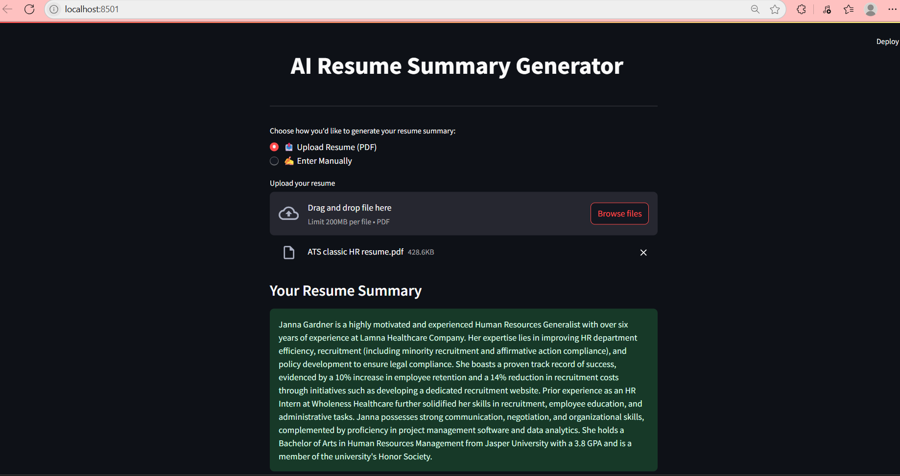

# AI Resume Summary Generator (Powered by Google Gemini)

This app helps you generate a professional resume summary in seconds using the Google Gemini 1.5 Flash model.  
Just provide a few details or upload your resume, and it will return a job-ready summary — perfect for applications or LinkedIn.

---

##  Live App

🔗 [Try the app now](https://gemini-resume-writer-ram.streamlit.app)

---

## Features

- Powered by `gemini-1.5-flash` – fast, free, and reliable
- Summarizes your resume in 2–4 professional lines
- Clean Streamlit interface with dual input modes
- Works well for any job role or domain

---

## How It Works

### 🔹 Manual Input
You can manually provide:
- Name
- Target job role
- Top skills
- Work experience

The app sends this to Gemini to generate a summary.

### 🔹 PDF Resume Upload
Prefer automation? Just upload your **resume PDF** and let the app:
- Extract the text using PyMuPDF
- Send it to Gemini for summarization

This is useful for:
- Job seekers looking to rewrite their summaries
- Recruiters needing a quick overview of a candidate
- Career coaches or websites to enhance user profiles

---

## Screenshots

  
  


---

## Technologies Used

- `Python 3.10+`
- `Streamlit`
- `google-generativeai` (Gemini API)
- `PyMuPDF` (for PDF text extraction)

---

## 📁 Folder Structure

```bash
gemini-resume-writer/
├── app.py
├── modules/
│   └── resume_utils.py
├── assets/
│   ├── screenshot1.png
│   ├── screenshot2.png
│   └── screenshot3.png
├── .streamlit/
│   └── secrets.toml
├── requirements.txt
└── README.md
