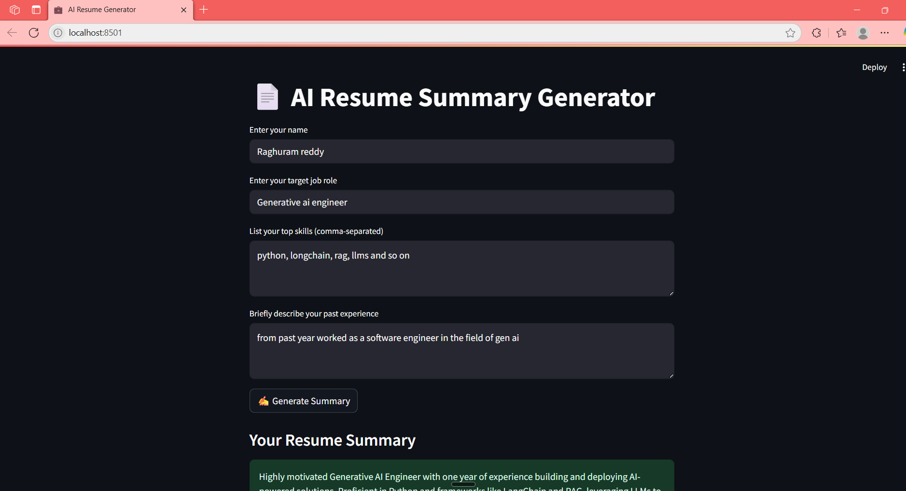
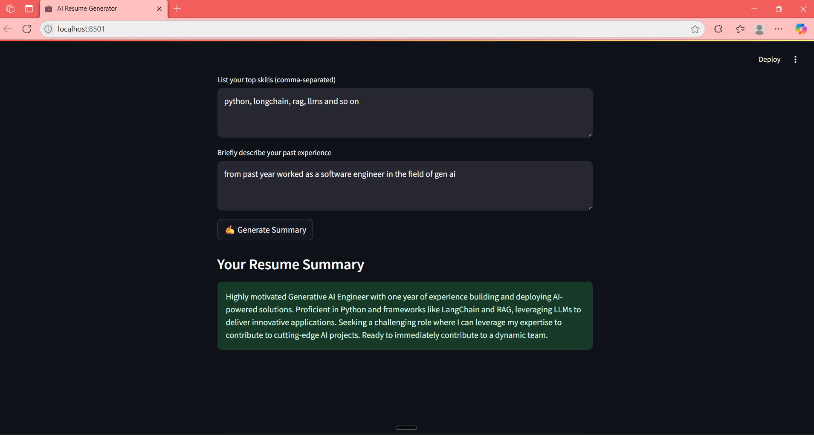

# AI Resume Summary Generator (Powered by Google Gemini)

This app helps you generate a professional resume summary in seconds using the Google Gemini 1.5 Flash model. Just paste your resume content, and it gives you a job-ready summary ideal for job applications and LinkedIn profiles.

---

## 🚀 Live App

[Click here to try the app](https://your-deployment-link.streamlit.app)  
*(Replace this link with your actual Streamlit Cloud link)*

---

## Features

- Fast and accurate results with `gemini-1.5-flash` (Google's free model)
- Clean, user-friendly UI built with Streamlit
- Summarizes your resume into 2–4 lines automatically
- Ready to customize for any job role or industry

---

## Use Case

Writing the summary at the top of your resume can be tough. This app removes the guesswork and helps you write a strong, relevant summary using Generative AI.

---

## Technologies Used

- Python 3.10+
- Streamlit
- Google Generative AI (Gemini 1.5 Flash)

---

## 📸 Screenshot

